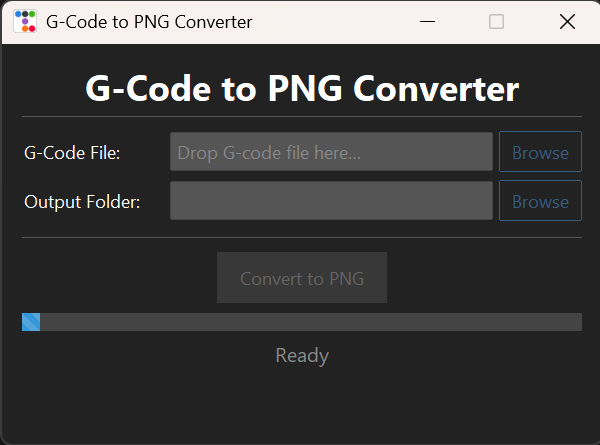

# G-Code Viewer for Aerotech

A dedicated visualization program for Aerotech pneumatic extrusion Direct Ink Writing (DIW) 3D printers. This application allows users to input their generated G-code and instantly view the resulting toolpath image, making it easy to verify prints before sending them to the hardware.

## 🚀 Features

* **Aerotech Compatibility:** Specifically designed to interpret G-code flavored for Aerotech pneumatic extrusion.
* **Instant Visualization:** Renders an accurate image of the toolpath based on the provided instructions.
* **Offline Processing:** Works completely locally with no internet connection required.

## 📸 Preview

## Installation 

Download the most recent app package for you operating system.